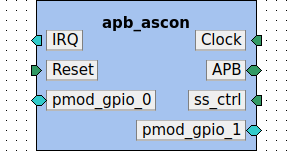

###### This document was generated by Kactus2 on 20.10.2024 18:05:10 by user Alexandre Menu  

**Table of contents**  

1. [Component emse.fr - ip - apb_ascon - 0.1](#emse.fr:ip:apb_ascon:0.1)  
	1.1. [Kactus2 attributes](#emse.fr:ip:apb_ascon:0.1.attributes)  
	1.2. [General parameters](#emse.fr:ip:apb_ascon:0.1.parameters)  
	1.3. [Memory maps](#emse.fr:ip:apb_ascon:0.1.memoryMaps)  
	1.4. [Ports](#emse.fr:ip:apb_ascon:0.1.ports)  
	1.5. [Bus interfaces](#emse.fr:ip:apb_ascon:0.1.interfaces)  
	1.6. [File sets](#emse.fr:ip:apb_ascon:0.1.fileSets)  
	1.7. [Views](#emse.fr:ip:apb_ascon:0.1.views)  

# 1. Component emse.fr:ip:apb_ascon:0.1<a id="emse.fr:ip:apb_ascon:0.1">  

**Description:** Cryptographic accelerator for the Ascon128 AEAD authenticated encryption scheme.  

**IP-Xact file:** [apb_ascon.0.1.xml](../ipxact/emse.fr/ip/apb_ascon/0.1/apb_ascon.0.1.xml)  

## 1.1 Kactus2 attributes <a id="emse.fr:ip:apb_ascon:0.1.attributes">  

**Product hierarchy:** Flat  
**Component implementation:** HW  
**Component firmness:** Mutable  

## 1.2 General parameters <a id="emse.fr:ip:apb_ascon:0.1.parameters">  

|Name|Type|Value|Resolve|Bit vector left|Bit vector right|Array left|Array right|Description|  
|:----|:----|:----|:----|:----|:----|:----|:----|:----|  
|APB_DW||32|||||||  
|APB_AW||10|||||||  
|BLK_PT_AW||3|||||||  
|BLK_AD_AW||3|||||||  
|BUF_DEPTH||4|||||||  
## 1.3 Memory maps <a id="emse.fr:ip:apb_ascon:0.1.memoryMaps">  

### 1.3.1 Memory map apb_ascon  

**Address unit bits (AUB):** 8  

### 1.3.1.1 Address block registers  

**Description:**   
**Usage:**   
**Base address [AUB]:** 'h0  
**Range [AUB]:** 56 + 16 * BUF_DEPTH  
**Width [AUB]:** 32  
**Access:**   
**Volatile:**   

#### Address block 'registers' contains the following registers:  

|Register name|Offset [AUB]|Size [bits]|Dimension|Volatile|Access|  
|:----|:----|:----|:----|:----|:----|  
|CTRL|'h0|32||||  
|STATUS|'h4|32||||  
|DATAOUT|'h58|32|BUF_DEPTH * 2|||  
|DATAIN|'h38|32|BUF_DEPTH * 2|||  
|TAG|'h28|32|4|||  
|NONCE|'h18|32|4|||  
|KEY|'h8|32|4|||  
### 1.3.1.1.1 Register CTRL  

**Description:**   
**Offset [AUB]:** 'h0  
**Size [bits]:** 32  
**Dimension:**   
**Volatile:**   
**Access:**   

#### Register 'CTRL' contains the following fields:  

|Field name|Offset [bits]|Width [bits]|Volatile|Access|Resets|Description|  
|:----|:----|:----|:----|:----|:----|:----|  
|PT_BLK_NO <a id="emse.fr:ip:apb_ascon:0.1.field.PT_BLK_NO">|24|BLK_PT_AW|||||  
|AD_BLK_NO <a id="emse.fr:ip:apb_ascon:0.1.field.AD_BLK_NO">|16|BLK_AD_AW|||||  
|DELAY <a id="emse.fr:ip:apb_ascon:0.1.field.DELAY">|8|8|||||  
|BUF_IN_VALID <a id="emse.fr:ip:apb_ascon:0.1.field.BUF_IN_VALID">|1|1|||||  
|CT_READ_ACK <a id="emse.fr:ip:apb_ascon:0.1.field.CT_READ_ACK">|2|1|||||  
|START <a id="emse.fr:ip:apb_ascon:0.1.field.START">|0|1|||||  
### 1.3.1.1.1.1 Field PT_BLK_NO  

**Offset [bits]:** 24  
**Width [bits]:** BLK_PT_AW  
**Volatile:**   
**Access:**   
**Resets:**   
**Description:**   

### 1.3.1.1.1.2 Field AD_BLK_NO  

**Offset [bits]:** 16  
**Width [bits]:** BLK_AD_AW  
**Volatile:**   
**Access:**   
**Resets:**   
**Description:**   

### 1.3.1.1.1.3 Field DELAY  

**Offset [bits]:** 8  
**Width [bits]:** 8  
**Volatile:**   
**Access:**   
**Resets:**   
**Description:**   

### 1.3.1.1.1.4 Field BUF_IN_VALID  

**Offset [bits]:** 1  
**Width [bits]:** 1  
**Volatile:**   
**Access:**   
**Resets:**   
**Description:**   

### 1.3.1.1.1.5 Field CT_READ_ACK  

**Offset [bits]:** 2  
**Width [bits]:** 1  
**Volatile:**   
**Access:**   
**Resets:**   
**Description:**   

### 1.3.1.1.1.6 Field START  

**Offset [bits]:** 0  
**Width [bits]:** 1  
**Volatile:**   
**Access:**   
**Resets:**   
**Description:**   

### 1.3.1.1.2 Register STATUS  

**Description:**   
**Offset [AUB]:** 'h4  
**Size [bits]:** 32  
**Dimension:**   
**Volatile:**   
**Access:**   

#### Register 'STATUS' contains the following fields:  

|Field name|Offset [bits]|Width [bits]|Volatile|Access|Resets|Description|  
|:----|:----|:----|:----|:----|:----|:----|  
|DONE <a id="emse.fr:ip:apb_ascon:0.1.field.DONE">|1|1|||||  
|READY <a id="emse.fr:ip:apb_ascon:0.1.field.READY">|0|1|||||  
|DATA_REQ <a id="emse.fr:ip:apb_ascon:0.1.field.DATA_REQ">|3|1|||||  
|CT_READY <a id="emse.fr:ip:apb_ascon:0.1.field.CT_READY">|2|1|||||  
### 1.3.1.1.2.1 Field DONE  

**Offset [bits]:** 1  
**Width [bits]:** 1  
**Volatile:**   
**Access:**   
**Resets:**   
**Description:**   

### 1.3.1.1.2.2 Field READY  

**Offset [bits]:** 0  
**Width [bits]:** 1  
**Volatile:**   
**Access:**   
**Resets:**   
**Description:**   

### 1.3.1.1.2.3 Field DATA_REQ  

**Offset [bits]:** 3  
**Width [bits]:** 1  
**Volatile:**   
**Access:**   
**Resets:**   
**Description:**   

### 1.3.1.1.2.4 Field CT_READY  

**Offset [bits]:** 2  
**Width [bits]:** 1  
**Volatile:**   
**Access:**   
**Resets:**   
**Description:**   

### 1.3.1.1.3 Register DATAOUT  

**Description:**   
**Offset [AUB]:** 'h58  
**Size [bits]:** 32  
**Dimension:** BUF_DEPTH * 2  
**Volatile:**   
**Access:**   

#### Register 'DATAOUT' contains the following fields:  

|Field name|Offset [bits]|Width [bits]|Volatile|Access|Resets|Description|  
|:----|:----|:----|:----|:----|:----|:----|  
|DATAOUT <a id="emse.fr:ip:apb_ascon:0.1.field.DATAOUT">|0|32|||||  
### 1.3.1.1.3.1 Field DATAOUT  

**Offset [bits]:** 0  
**Width [bits]:** 32  
**Volatile:**   
**Access:**   
**Resets:**   
**Description:**   

### 1.3.1.1.4 Register DATAIN  

**Description:**   
**Offset [AUB]:** 'h38  
**Size [bits]:** 32  
**Dimension:** BUF_DEPTH * 2  
**Volatile:**   
**Access:**   

#### Register 'DATAIN' contains the following fields:  

|Field name|Offset [bits]|Width [bits]|Volatile|Access|Resets|Description|  
|:----|:----|:----|:----|:----|:----|:----|  
|DATAIN <a id="emse.fr:ip:apb_ascon:0.1.field.DATAIN">|0|32|||||  
### 1.3.1.1.4.1 Field DATAIN  

**Offset [bits]:** 0  
**Width [bits]:** 32  
**Volatile:**   
**Access:**   
**Resets:**   
**Description:**   

### 1.3.1.1.5 Register TAG  

**Description:**   
**Offset [AUB]:** 'h28  
**Size [bits]:** 32  
**Dimension:** 4  
**Volatile:**   
**Access:**   

#### Register 'TAG' contains the following fields:  

|Field name|Offset [bits]|Width [bits]|Volatile|Access|Resets|Description|  
|:----|:----|:----|:----|:----|:----|:----|  
|TAG <a id="emse.fr:ip:apb_ascon:0.1.field.TAG">|0|32|||||  
### 1.3.1.1.5.1 Field TAG  

**Offset [bits]:** 0  
**Width [bits]:** 32  
**Volatile:**   
**Access:**   
**Resets:**   
**Description:**   

### 1.3.1.1.6 Register NONCE  

**Description:**   
**Offset [AUB]:** 'h18  
**Size [bits]:** 32  
**Dimension:** 4  
**Volatile:**   
**Access:**   

#### Register 'NONCE' contains the following fields:  

|Field name|Offset [bits]|Width [bits]|Volatile|Access|Resets|Description|  
|:----|:----|:----|:----|:----|:----|:----|  
|NONCE <a id="emse.fr:ip:apb_ascon:0.1.field.NONCE">|0|32|||||  
### 1.3.1.1.6.1 Field NONCE  

**Offset [bits]:** 0  
**Width [bits]:** 32  
**Volatile:**   
**Access:**   
**Resets:**   
**Description:**   

### 1.3.1.1.7 Register KEY  

**Description:**   
**Offset [AUB]:** 'h8  
**Size [bits]:** 32  
**Dimension:** 4  
**Volatile:**   
**Access:**   

#### Register 'KEY' contains the following fields:  

|Field name|Offset [bits]|Width [bits]|Volatile|Access|Resets|Description|  
|:----|:----|:----|:----|:----|:----|:----|  
|KEY <a id="emse.fr:ip:apb_ascon:0.1.field.KEY">|0|32|||||  
### 1.3.1.1.7.1 Field KEY  

**Offset [bits]:** 0  
**Width [bits]:** 32  
**Volatile:**   
**Access:**   
**Resets:**   
**Description:**   

## 1.4 Ports <a id="emse.fr:ip:apb_ascon:0.1.ports">  

|Name|Direction|Left bound|Right bound|Port type|Type definition|Default value|Array left|Array right|Description|  
|:----|:----|:----|:----|:----|:----|:----|:----|:----|:----|  
|clk_in <a id="emse.fr:ip:apb_ascon:0.1.port.clk_in">|in|||logic||||||  
|irq_1 <a id="emse.fr:ip:apb_ascon:0.1.port.irq_1">|out|||logic||||||  
|PADDR <a id="emse.fr:ip:apb_ascon:0.1.port.PADDR">|in|APB_AW-1|0|logic||||||  
|PENABLE <a id="emse.fr:ip:apb_ascon:0.1.port.PENABLE">|in|||logic||||||  
|PRDATA <a id="emse.fr:ip:apb_ascon:0.1.port.PRDATA">|out|APB_DW-1|0|logic||||||  
|PREADY <a id="emse.fr:ip:apb_ascon:0.1.port.PREADY">|out|||logic||||||  
|PSEL <a id="emse.fr:ip:apb_ascon:0.1.port.PSEL">|in|||logic||||||  
|PSLVERR <a id="emse.fr:ip:apb_ascon:0.1.port.PSLVERR">|out|||logic||||||  
|PWDATA <a id="emse.fr:ip:apb_ascon:0.1.port.PWDATA">|in|APB_DW-1|0|logic||||||  
|PWRITE <a id="emse.fr:ip:apb_ascon:0.1.port.PWRITE">|in|||logic||||||  
|reset_int <a id="emse.fr:ip:apb_ascon:0.1.port.reset_int">|in|||logic||||||  
|ss_ctrl_1 <a id="emse.fr:ip:apb_ascon:0.1.port.ss_ctrl_1">|in|7|0|logic||||||  
|irq_en_1 <a id="emse.fr:ip:apb_ascon:0.1.port.irq_en_1">|in|||logic||||||  
|pmod_0_gpo <a id="emse.fr:ip:apb_ascon:0.1.port.pmod_0_gpo">|out|3|0|logic||||||  
|pmod_0_gpi <a id="emse.fr:ip:apb_ascon:0.1.port.pmod_0_gpi">|in|3|0|logic||||||  
|pmod_0_gpio_oe <a id="emse.fr:ip:apb_ascon:0.1.port.pmod_0_gpio_oe">|out|3|0|logic||||||  
|pmod_1_gpo <a id="emse.fr:ip:apb_ascon:0.1.port.pmod_1_gpo">|out|3|0|logic||||||  
|pmod_1_gpi <a id="emse.fr:ip:apb_ascon:0.1.port.pmod_1_gpi">|in|3|0|logic||||||  
|pmod_1_gpio_oe <a id="emse.fr:ip:apb_ascon:0.1.port.pmod_1_gpio_oe">|out|3|0|logic||||||  
## 1.5 Bus interfaces <a id="emse.fr:ip:apb_ascon:0.1.interfaces">  

### 1.5.1 Bus interface Clock  

**Description:**   
**Interface mode:** target  
**Bus definition:** tuni.fi:interface:clock:1.0  
**Abstraction definitions:** tuni.fi:interface:clock.absDef:1.0  
**Ports used in this interface:**   

|Name|Direction|Left bound|Right bound|Port type|Type definition|Default value|Array left|Array right|Description|  
|:----|:----|:----|:----|:----|:----|:----|:----|:----|:----|  
|clk_in <a id="emse.fr:ip:apb_ascon:0.1.port.clk_in">|in|||logic||||||  
### 1.5.2 Bus interface IRQ  

**Description:**   
**Interface mode:** initiator  
**Bus definition:** tuni.fi:interface:IRQ:1.0  
**Abstraction definitions:** tuni.fi:interface:IRQ.absDef:1.0  
**Ports used in this interface:**   

|Name|Direction|Left bound|Right bound|Port type|Type definition|Default value|Array left|Array right|Description|  
|:----|:----|:----|:----|:----|:----|:----|:----|:----|:----|  
|irq_1 <a id="emse.fr:ip:apb_ascon:0.1.port.irq_1">|out|||logic||||||  
### 1.5.3 Bus interface APB  

**Description:**   
**Interface mode:** target  
**Bus definition:** tuni.fi:interface:APB:1.0  
**Abstraction definitions:** tuni.fi:interface:APB.absDef:1.0  
**Ports used in this interface:**   

|Name|Direction|Left bound|Right bound|Port type|Type definition|Default value|Array left|Array right|Description|  
|:----|:----|:----|:----|:----|:----|:----|:----|:----|:----|  
|PADDR <a id="emse.fr:ip:apb_ascon:0.1.port.PADDR">|in|APB_AW-1|0|logic||||||  
|PENABLE <a id="emse.fr:ip:apb_ascon:0.1.port.PENABLE">|in|||logic||||||  
|PRDATA <a id="emse.fr:ip:apb_ascon:0.1.port.PRDATA">|out|APB_DW-1|0|logic||||||  
|PREADY <a id="emse.fr:ip:apb_ascon:0.1.port.PREADY">|out|||logic||||||  
|PSEL <a id="emse.fr:ip:apb_ascon:0.1.port.PSEL">|in|||logic||||||  
|PSLVERR <a id="emse.fr:ip:apb_ascon:0.1.port.PSLVERR">|out|||logic||||||  
|PWDATA <a id="emse.fr:ip:apb_ascon:0.1.port.PWDATA">|in|APB_DW-1|0|logic||||||  
|PWRITE <a id="emse.fr:ip:apb_ascon:0.1.port.PWRITE">|in|||logic||||||  
### 1.5.4 Bus interface Reset  

**Description:**   
**Interface mode:** target  
**Bus definition:** tuni.fi:interface:reset:1.0  
**Abstraction definitions:** tuni.fi:interface:reset.absDef:1.0  
**Ports used in this interface:**   

|Name|Direction|Left bound|Right bound|Port type|Type definition|Default value|Array left|Array right|Description|  
|:----|:----|:----|:----|:----|:----|:----|:----|:----|:----|  
|reset_int <a id="emse.fr:ip:apb_ascon:0.1.port.reset_int">|in|||logic||||||  
### 1.5.5 Bus interface ss_ctrl  

**Description:**   
**Interface mode:** target  
**Bus definition:** tuni.fi:interface:SS_Ctrl:1.0  
**Abstraction definitions:** tuni.fi:interface:SS_Ctrl.absDef:1.0  
**Ports used in this interface:**   

|Name|Direction|Left bound|Right bound|Port type|Type definition|Default value|Array left|Array right|Description|  
|:----|:----|:----|:----|:----|:----|:----|:----|:----|:----|  
|ss_ctrl_1 <a id="emse.fr:ip:apb_ascon:0.1.port.ss_ctrl_1">|in|7|0|logic||||||  
|irq_en_1 <a id="emse.fr:ip:apb_ascon:0.1.port.irq_en_1">|in|||logic||||||  
### 1.5.6 Bus interface pmod_gpio_0  

**Description:**   
**Interface mode:** initiator  
**Bus definition:** tuni.fi:interface:GPIO:1.0  
**Abstraction definitions:** tuni.fi:interface:GPIO.absDef:1.0  
**Ports used in this interface:**   

|Name|Direction|Left bound|Right bound|Port type|Type definition|Default value|Array left|Array right|Description|  
|:----|:----|:----|:----|:----|:----|:----|:----|:----|:----|  
|pmod_0_gpo <a id="emse.fr:ip:apb_ascon:0.1.port.pmod_0_gpo">|out|3|0|logic||||||  
|pmod_0_gpi <a id="emse.fr:ip:apb_ascon:0.1.port.pmod_0_gpi">|in|3|0|logic||||||  
|pmod_0_gpio_oe <a id="emse.fr:ip:apb_ascon:0.1.port.pmod_0_gpio_oe">|out|3|0|logic||||||  
### 1.5.7 Bus interface pmod_gpio_1  

**Description:**   
**Interface mode:** initiator  
**Bus definition:** tuni.fi:interface:GPIO:1.0  
**Abstraction definitions:** tuni.fi:interface:GPIO.absDef:1.0  
**Ports used in this interface:**   

|Name|Direction|Left bound|Right bound|Port type|Type definition|Default value|Array left|Array right|Description|  
|:----|:----|:----|:----|:----|:----|:----|:----|:----|:----|  
|pmod_1_gpo <a id="emse.fr:ip:apb_ascon:0.1.port.pmod_1_gpo">|out|3|0|logic||||||  
|pmod_1_gpi <a id="emse.fr:ip:apb_ascon:0.1.port.pmod_1_gpi">|in|3|0|logic||||||  
|pmod_1_gpio_oe <a id="emse.fr:ip:apb_ascon:0.1.port.pmod_1_gpio_oe">|out|3|0|logic||||||  
## 1.6 File sets <a id="emse.fr:ip:apb_ascon:0.1.fileSets">  

### 1.6.1 File set external_include  

**Identifiers:**   

#### 1.6.1.1 Files  

|File name|Logical name|Build command|Build flags|Specified file types|Description|  
|:----|:----|:----|:----|:----|:----|  
|[ascon.svh](../src/sv/include/ascon.svh)||||unknown||  
|[registers.svh](../src/sv/include/registers.svh)||||unknown||  
### 1.6.2 File set external_sv  

**Identifiers:**   

#### 1.6.2.1 Files  

|File name|Logical name|Build command|Build flags|Specified file types|Description|  
|:----|:----|:----|:----|:----|:----|  
|[readme.md](../src/sv/readme.md)||||unknown||  
### 1.6.3 File set external_rtl  

**Identifiers:**   

#### 1.6.3.1 Files  

|File name|Logical name|Build command|Build flags|Specified file types|Description|  
|:----|:----|:----|:----|:----|:----|  
|[apb_ascon.sv](../src/sv/rtl/apb_ascon.sv)||||systemVerilogSource||  
|[ascon_fsm.sv](../src/sv/rtl/ascon_fsm.sv)||||systemVerilogSource||  
|[ascon_pack.sv](../src/sv/rtl/ascon_pack.sv)||||systemVerilogSource||  
|[ascon_top.sv](../src/sv/rtl/ascon_top.sv)||||systemVerilogSource||  
|[ascon_wrapper.sv](../src/sv/rtl/ascon_wrapper.sv)||||systemVerilogSource||  
|[block_counter.sv](../src/sv/rtl/block_counter.sv)||||systemVerilogSource||  
|[permutation.sv](../src/sv/rtl/permutation.sv)||||systemVerilogSource||  
|[round_counter.sv](../src/sv/rtl/round_counter.sv)||||systemVerilogSource||  
### 1.6.4 File set Documentation  

**Identifiers:** documentation  

#### 1.6.4.1 Files  

|File name|Logical name|Build command|Build flags|Specified file types|Description|  
|:----|:----|:----|:----|:----|:----|  
|[ascon.md](ascon.md)||||markdown|File that contains the documentation for this component and subcomponents|  
|[emse.fr.ip.apb_ascon.0.1.png](images/emse.fr.ip.apb_ascon.0.1.png)||||picture, pngImage|Preview picture needed by the documentation.|  
## 1.7 Views <a id="emse.fr:ip:apb_ascon:0.1.views">  

### 1.7.1 View: flat_verilog  

#### 1.7.1.1 Component instantiation: verilog_implementation  

**Language:** Verilog  

**Module name:** apb_ascon  

**Module parameters:**  

|Name|Type|Value|Data type|Usage type|Resolve|Bit vector left|Bit vector right|Array left|Array right|Description|  
|:----|:----|:----|:----|:----|:----|:----|:----|:----|:----|:----|  
|APB_AW||APB_AW||nontyped|||||||  
|APB_DW||APB_DW||nontyped|||||||  
|BLK_PT_AW||BLK_PT_AW|||||||||  
|BLK_AD_AW||BLK_AD_AW|||||||||  
|BUF_DEPTH||BUF_DEPTH||nontyped|||||||  

